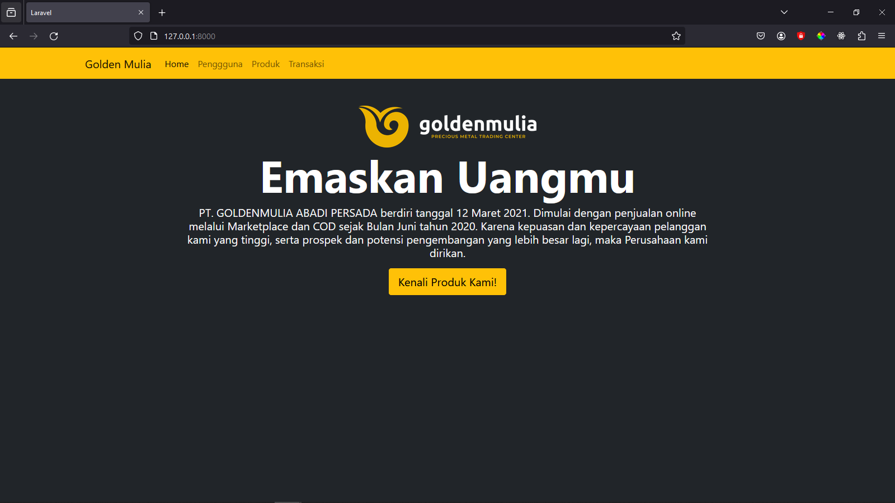
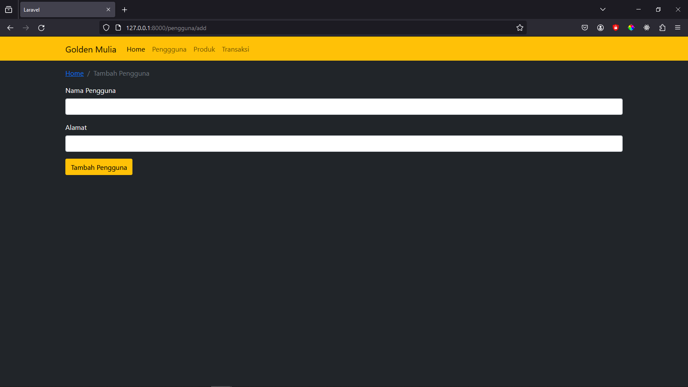
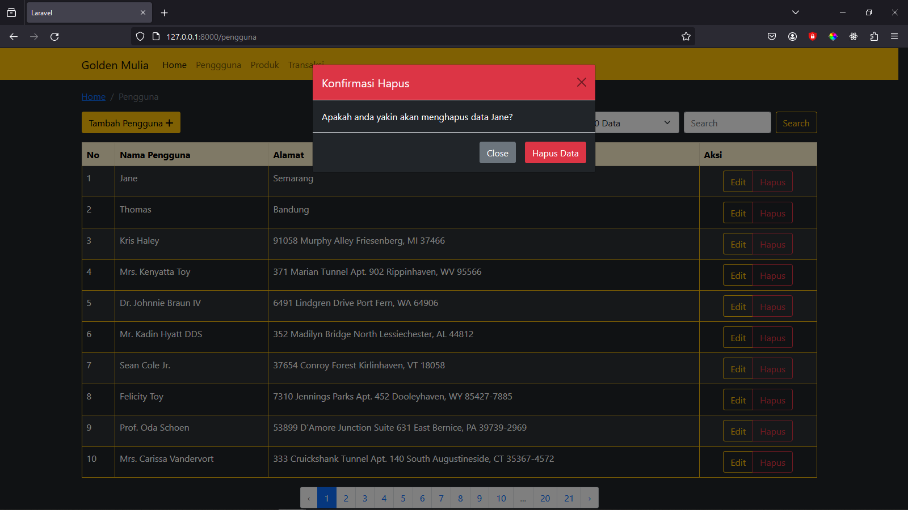
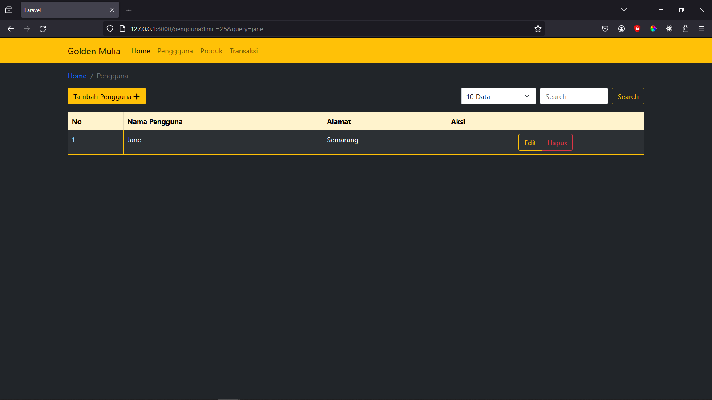
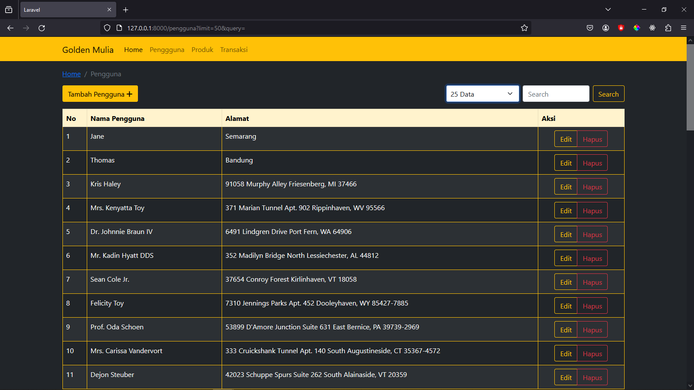

# Nama Proyek Laravel Sederhana

Proyek ini adalah aplikasi web sederhana yang dibangun dengan menggunakan Laravel versi 10 dan didukung oleh framework CSS Bootstrap. Proyek ini menyediakan fitur CRUD, limitasi, pencarian query, dan pagination.

## Tangkapan Layar

Berikut adalah tangkapan layar dari proyek ini:

### Halaman Utama



### Halaman Master Data


### Halaman Tambah Pengguna



### Halaman Edit Pengguna


### Halaman Hapus Pengguna



### Pencarian Pengguna



### Limitasi



## Fitur

- **CRUD (Create, Read, Update, Delete):** Tambah, lihat, edit, dan hapus pengguna.
- **Limitasi:** Atur batas jumlah data yang ditampilkan.
- **Pencarian Query:** Cari pengguna berdasarkan nama.
- **Pagination:** Bagi hasil pencarian menjadi halaman-halaman.

## Cara Menjalankan Proyek

1. Clone repositori ini:

    ```bash
    git clone https://github.com/username/repo.git
    ```

2. Masuk ke direktori proyek:

    ```bash
    cd nama-proyek-laravel
    ```

3. Install dependensi:

    ```bash
    composer install
    ```

4. Salin file `.env.example` ke `.env` dan sesuaikan konfigurasi database:

    ```bash
    cp .env.example .env
    ```

5. Generate key aplikasi:

    ```bash
    php artisan key:generate
    ```

6. Migrasikan database:

    ```bash
    php artisan migrate
    ```

7. Jalankan server lokal:

    ```bash
    php artisan serve
    ```

8. Buka proyek di browser: [http://localhost:8000](http://localhost:8000)

## Kontribusi

Jika Anda menemui bug atau memiliki saran untuk perbaikan, jangan ragu untuk membuka *issue* atau mengirim *pull request*. Kami sangat menyambut kontribusi Anda!

